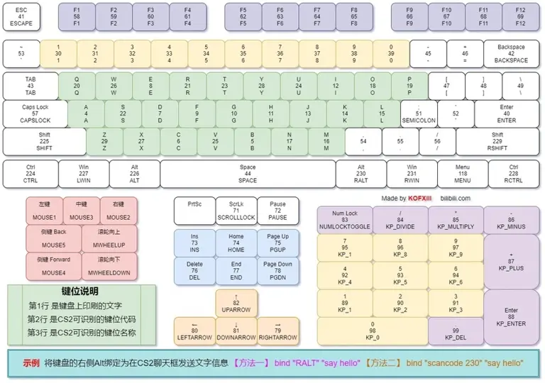

# 启动项

```c
-perfectworld -noreflex -highpriority -novid  -exec autoexec.cfg

//══════════════════════ 启动项说明 ══════════════════════
// 推荐启动项（各指令间用空格分开）：
// -high -novid -nojoy -d3d9ex -freq 240 -tickrate 128 +exec autoexec.cfg
 -perfectworl         //完美世界
 -novid               // 关闭过场动画
 -nojoy -d3d9ex       // 优化帧数
 -freq 240            // 固定刷新率为240
 -tickrate 128        // 服务器tick率128
 +exec autoexec.cfg   // 自动加载本配置
 -threads 6           // 设定游戏使用的CPU线程数
 -freq 240            // 设定游戏显示器刷新率 (例如 240)
 -d3d9ex              // 启用D3D9Ex技术优化性能并加快切屏
 -novid               // 跳过游戏开头动画
 -no-browser          // 禁用游戏内浏览器
 +mat_queue_mode 2    // 开启多核渲染提高帧率
 +fps_max 0           // 解除游戏最大帧率限制
 +cl_interp_ratio 1   // 设置插值比例 (建议1或2)
 +cl_interp 0.031     // 设置插值时间 (在线游戏不建议设为0或0.031)
 -tickrate 128        // 设置离线服务器/机器人游戏tickrate
 +cl_cmdrate 128      // 设定客户端发送命令速率
 +cl_updaterate 128   // 设定客户端接收更新速率
 +cl_forcepreload 1   // 提前加载地图文件
 -w 1920 -h 1080      // 设定游戏启动分辨率 (例如 -w 1280 -h 960)
 -language Chinese    // 设定游戏语言为中文
 -full                // 全屏游戏
//═══════════════════════════════════════════════════════════
```

# autoexec.cfg

## 基础设置

```c
//══════════════════════ 基础设置 ══════════════════════
con_enable 1                     // 开启控制台
fps_max 0                        // 最大帧数（0为不限制）

// 遥测信息
cl_showfps "0"
cl_hud_telemetry_frametime_show 2           // 显示帧间时间及FPS(0--从不，1--如果条件恶劣，2--总是)
cl_hud_telemetry_frametime_poor 100         // 帧间时间警告阈值(0~100)
cl_hud_telemetry_ping_show 2                // 显示延迟(0--从不，1--如果条件恶劣，2--总是)
cl_hud_telemetry_net_misdelivery_show 2     // 显示网络问题(0--从不，1--如果条件恶劣，2--总是)
cl_hud_telemetry_net_misdelivery_poor 5     // 网络tick丢失率警告阈值(0~5)
cl_hud_telemetry_net_quality_graph_show 1   // 显示网络抖动/误差图(0--从不，1--如果条件恶劣，2--总是)
cl_hud_telemetry_net_detailed 1             // 使用详细的网络质量显示(0--从不，1--如果条件恶劣，2--总是)

// 游戏设置
cl_autohelp 0                    // 禁用游戏提示
cl_showpos 0                     // 不显示位置速度信息
cl_dm_buyrandomweapons 0         // 关闭死斗随机买枪
cl_use_opens_buy_menu 0          // 关闭E键打开购买菜单
r_drawtracers_firstperson 1      // 开启曳光弹道
gameinstructor_enable 0          // 关闭游戏教学
spec_replay_autostart 1          // 关闭被击杀回放
mm_dedicated_search_maxping 120  // 最大匹配延迟ms
//rate 786432                    // 最大游戏流量带宽

// 团队显示
cl_crosshair_friendly_warning 1  //瞄准队友时叠加特殊准星 <0.不显示 1.仅使用默认准星时显示 3.一直显示>
cl_teamid_overhead_mode 3        //隔墙显示队友位置    <0.不显示，1.显示位置，2.显示位置和名字，3.显示队友位置、名字和装备>
cl_teamid_overhead_colors_show 1 //在队伍ID上使用玩家颜色 <0.否，1.是>
cl_teammate_colors_show 2        //竞技模式队友颜色    <0.不显示 1.显示颜色 2.显示颜色和文字>
cl_hide_avatar_images 0          //隐藏头像图片(0--全部显示，1--全部隐藏，2--只显示好友)

// 物品设置
cl_sniper_delay_unscope 0        //狙击枪开枪后延迟开镜(0--否，1--是)
cl_sniper_auto_rezoom 1          //开枪后狙击步枪自动重新开镜(0--否，1--是)
cl_silencer_mode 0               //卸下M4A1-S和USP-S消音器(1--第二开火，0--已禁用)
cl_showloadout 1                 //总是显示物品栏(0--否，1--是)
cl_buywheel_donate_key 0         //捐赠武器快捷键 (0--左CTRL键，1--左ALT键，2--左SHIFT键)

// Steam提示位置
ui_steam_overlay_notification_position "topright"
//═══════════════════════════════════════════════════════════
```

## 常用别名命令

```c
//══════════════════════ 常用别名命令 ══════════════════════
alias "d" "disconnect"           // 快速断开
alias "q" "quit"                 // 快速退出
alias "s" "status"               // 查看状态
alias "rs" "mp_restartgame 1"    // 重开一局
alias "cfg" "exec autoexec.cfg"  // 重新加载本配置
alias "pt" "exec practice.cfg"   // 跑图配置
alias "1v1" "exec 1v1.cfg"       // 1v1配置
alias "pt-h" "practice_help"     // 跑图指令 help
//═══════════════════════════════════════════════════════════
```

## 鼠标设置

```c
//══════════════════════ 鼠标设置 ══════════════════════
sensitivity "1.25"               // 灵敏度
m_yaw "0.022"                    // y轴灵敏度
//═══════════════════════════════════════════════════════════
```

## 准星&持枪设置

```c
//══════════════════════ 准星&持枪设置 ══════════════════════
cl_crosshairstyle 4              // 准星风格（4经典静态）
cl_crosshair_recoil 0            // 跟随后坐力
cl_crosshairdot 0                // 中心点
cl_crosshairsize 1.4               // 长度
cl_crosshairthickness 0.0         // 粗细
cl_crosshairgap -2.7               // 间隙
cl_crosshair_drawoutline 0       // 轮廓开关
cl_crosshair_outlinethickness 1.5  // 轮廓厚度
cl_crosshaircolor_r 0            // 红色分量
cl_crosshaircolor_g 255          // 绿色分量
cl_crosshaircolor_b 255          // 蓝色分量
cl_crosshairusealpha 1           // 透明度开关
cl_crosshairalpha 255            // 透明度
cl_crosshair_t 0                 // T形准星
cl_crosshairgap_useweaponvalue 0 // 启用准星间距设置
cl_crosshair_sniper_width 1      // 狙击十字线粗细
// 其他
cl_ironsight_usecrosshaircolor 1 // 狙击镜准星颜色
cl_crosshair_friendly_warning 1  // 瞄准队友警告
cl_show_observer_crosshair 2     // 观察者准星
cl_observed_bot_crosshair 1      // 观察BOT时显示我的准星

// 持枪视角参数
viewmodel_fov "68"
viewmodel_offset_x "2.5"
viewmodel_offset_y "0"
viewmodel_offset_z "-1.5"
viewmodel_presetpos "2"          // 持枪视角预设<1.默认 2.写实 3.经典>
toggle cl_righthand 1                   // 右手持枪
//═══════════════════════════════════════════════════════════
```

## 视频设置

```c
//══════════════════════ 视频设置 ══════════════════════
//r_fullscreen_gamma "2.2"         // 亮度 越小越亮 <1.6~2.6>
//═══════════════════════════════════════════════════════════
```

## 声音设置

```c
//══════════════════════ 声音设置 ══════════════════════
//volume 1                       // 主音量
snd_menumusic_volume 0.33        // 主菜单音乐音量
snd_roundstart_volume 0          // 回合开始音量
snd_roundend_volume 0            // 回合结束音量
snd_mapobjective_volume 0        // 炸弹/人质音量
snd_tensecondwarning_volume 0.045// 十秒警告音量
snd_deathcamera_volume 0.        // 死亡视角音量
snd_mvp_volume 0.45              // MVP音量
voice_modenable 1                // 启用语音
//bind "F1" "volume 0.08"        // F1主音量0.08
//bind "F2" "volume 0.38"        // F2主音量0.38
//═══════════════════════════════════════════════════════════
```

## HUD设置

```c
//══════════════════════ HUD设置 ══════════════════════
cl_color 1                       //队伍中颜色 <0.黄色 1.紫色 2.绿色 3.蓝色 4.橙色>
cl_hud_color 12                  // HUD颜色（玩家颜色）<0.队伍颜色，1.白色，2.亮白色，3.淡蓝色，4.蓝色，5.紫色，6.红色，7.橙色，8.黄色，9.绿色，10.浅绿色，11.粉红色，12.玩家颜色>

// 雷达设置
cl_hud_radar_scale 1                //雷达大小
cl_radar_scale 0.25                 //雷达缩放    
cl_radar_scale_alternate 1          //雷达地图切换缩放(0.25~1)
cl_radar_icon_scale_min 0.4         //雷达人物标点大小
cl_radar_rotate 1                   //雷达旋转[不用改]
cl_radar_always_centered 0          //雷达以玩家为中心[不用改]
cl_hud_radar_map_additive 1         //雷达HUD地图与背景融合(0--否，1--是)
cl_hud_radar_background_alpha 0.63  //雷达HUD背景透明度(0~1)
cl_radar_scale_dynamic 0            //雷达动态缩放(0--否，1--是)
cl_radar_square_with_scoreboard 1   //切换计分板外观(0--圆形，1--方形)
hud_showtargetid 1                  //显示队友/敌人id
safezonex 1                         //HUD水平方向缩放百分比
safezoney 1                         //HUD竖直方向缩放百分比
//═══════════════════════════════════════════════════════════
```

## 按键绑定



```c
//══════════════════════ 按键绑定 ══════════════════════
// 武器切换
bind "1" "slot1"                     // 主武器
bind "v" "+voicerecord"              // 语音
bind "MOUSE3" "player_ping"          // 鼠标中键标记
bind "SHIFT" "+sprint;r_cleardecals" // 跑步+清血迹
bind "CTRL" "+duck;r_cleardecals"    // 蹲下+清血迹
bind "MOUSE4" "toggle cl_righthand"  // 切换左右手
bind "alt" "noclip"                      // 飞行
alias mute "toggle volume 0 1"       // 静音切换

// 聊天/功能
bind "F1" "say_team .drop"           // 丢刀
bind "F7" "say_team .pause"          // 暂停
bind "F8" "say_team .unpause"        // 取消暂停
bind "CAPSLOCK" "toggleradarscale"   // 雷达缩放
bind "F5" "radio1"                   // 无线电消息

// 跳跃
bind "MWHEELDOWN" "+jump"           // 滚轮下跳
bind "SPACE" "+jump"                // 空格跳

// 快速切换道具
bind "z" "slot10"                    // 火
bind "x" "slot8"                     // 烟
bind "c" "slot3;slot7"               // 闪
bind "4" "slot6"                     // 雷
bind "" "slot9"                     // 诱饵雷
//═══════════════════════════════════════════════════════════
```

## 其他

```c
//══════════════════════ 其它 ══════════════════════
host_writeconfig                     // 保存配置 自动执行
echo "[CFG] Loaded CS2 autoexec.cfg" // 控制台提示
//═══════════════════════════════════════════════════════════
```


# practice.cfg

```c
// =====================   1.跑图指令   =====================
sv_cheats 1     //作弊模式（开）

mp_restartgame 1      //（1s）后重新开始游戏

mp_humanteam any      //随意选阵营

mp_limitteams 0       //CT和T的人数差限制（关）

mp_autoteambalance 0      //自动平衡人数（关）

mp_forcecamera 0       //限制观察者观看队伍（关）

mp_spectators_max 9      //观察者最大人数（9人）

cl_versus_intro 0      //开局阵营展示过场动画（关）

mp_team_intro_time 0      //开局阵营展示过场动画的时间设置为（0s）

sv_alltalk 1      //双方队伍语音互通（开）

sv_deadtalk 1      //死亡后允许说话（开）

mp_autokick 0      //自动踢人（关）

mp_roundtime_defuse 60      //每局时间（60min）

mp_maxrounds 100      //最大局数（100局）

mp_warmup_end      //结束热身时间

mp_freezetime 1      //冻结时间（开）

mp_startmoney 99999      //初始金钱（99999$）

mp_maxmoney 99999      //最大金钱（99999$）

mp_buytime 99999      //随时购买（99999$）

mp_buy_anywhere 1      //随处购买（开）

mp_ignore_round_win_conditions 1      //忽略胜利条件（开）

mp_round_restart_delay 0      //每回合结束等待时间（0s）

mp_respawn_immunitytime 0      //重生保护时间（0s）

mp_respawn_on_death_ct 1      //CT死亡后复活（开）

mp_respawn_on_death_t 1      //T死亡后复活（开）

mp_respawnwavetime_ct 0      //CT复活延迟（关）

mp_respawnwavetime_t 0      //T复活延迟（关）

bot_join_after_player 1      //BOT在玩家后加入（开）

bot_chatter off      //关闭BOT语音

bot_kick      //踢出BOT

bot_stop 1      //禁止BOT移动（开）

bot_dont_shoot 1      //禁止BOT开枪（开）

sv_infinite_ammo 2      //无限子弹：1   无限弹匣：2

mp_drop_knife_enable 1      //允许丢刀（开）

mp_free_armor 2      //开局带全甲（开）

mp_weapons_allow_typecount -1      //同一回合允许重复购买同一种武器的次数（1）

ammo_grenade_limit_total 999      //携带投掷物数量（999）

ammo_grenade_limit_default 2      //携带单个道具数量无限（开）

sv_grenade_trajectory_prac_trailtime 5      //投掷物轨迹滞留时间（5s）

sv_grenade_trajectory_prac_pipreview 1      //左下角投掷物预测窗口（开）

sv_showimpacts 2        // 显示着弹点

mp_friendlyfire 0      //友军伤害（关）

sv_falldamage_scale 1      //坠落伤害（开）

sv_regeneration_force_on 1      //自动回血（开）

mp_anyone_can_pickup_c4 0      //所有人可捡包（关）

mp_plant_c4_anywhere 0      //任意地点下包（关）

mp_ct_default_primary weapon_m4a1_silencer      //CT默认主武器

mp_ct_default_secondary weapon_usp_silencer      //CT默认副武器

mp_ct_default_grenades weapon_hegrenade weapon_incgrenade weapon_smokegrenade weapon_flashbang weapon_decoy      //开局自带投掷物

mp_t_default_primary weapon_ak47      //T默认主武器

mp_t_default_secondary weapon_usp_silencer      //T默认副武器

mp_t_default_grenades weapon_hegrenade weapon_molotov weapon_smokegrenade weapon_flashbang weapon_decoy      //开局自带投掷物

mp_death_drop_gun 1      //角色死亡后掉落武器（开）

mp_death_drop_grenade 0      //角色死亡后掉落投掷物（关）

mp_death_drop_defuser 0      //角色死亡后掉落拆弹器（关）

subclass_create 515      //生成一把蝴蝶刀(刺刀500 海豹短刀503 折叠刀505 穿肠刀506 爪子刀507 M9刺刀508 猎杀者匕首509 弯刀512 鲍伊猎刀514 蝴蝶刀515 暗影双匕516 系绳匕首517 求生匕首518 熊刀519 折刀520 流浪者匕首521 短剑522 锯齿爪刀523 骷髅匕首525 廓尔喀刀526)

subclass_create 508

subclass_create 525

// ent_fire weapon_knife changesubclass 507      //把手里的刀替换成蝴蝶刀(刺刀500 海豹短刀503 折叠刀505 穿肠刀506 爪子刀507 M9刺刀508 猎杀者匕首509 弯刀512 鲍伊猎刀514 蝴蝶刀515 暗影双匕516 系绳匕首517 求生匕首518 熊刀519 折刀520 流浪者匕首521 短剑522 锯齿爪刀523 骷髅匕首525 廓尔喀刀526) 


// =====================   2.跑图快捷键   =====================

bind alt "noclip"       //飞行穿墙【Alt】

bind F1 "pwa_rethrow_last_grenade; sv_rethrow_last_grenade"      //重复上一个投掷物【F1】

bind F2 "pwa_kill_smokegrenade; ent_fire smokegrenade_projectile kill;ent_fire flashbang_projectile kill;ent_fire hegrenade_projectile kill;ent_fire decoy_projectile kill;ent_fire inferno kill"      //消除投掷物效果【F2】

bind F5 "ent_fire weapon_knife changesubclass 507"      //一键换爪子刀【F5】

bind F6 "ent_fire weapon_knife changesubclass 508"      //一键换M9刺刀【F6】

bind F7 "ent_fire weapon_knife changesubclass 525"      //一键换骷髅匕首【F7】

bind F8 "ent_fire weapon_knife changesubclass 515"      //一键换蝴蝶刀【F8】

bind F9 "give item_assaultsuit"      //补甲【F9】

bind \ say_team .sg       //屏蔽闪光效果(完美平台跑图)【\】

bind Enter say_team .tz       //回到上一次投掷的位置(完美平台跑图)【Enter】

bind _ "bot_add t;pwa_bot_add; bot_place"      //添加一个T BOT 并在准星处放置放置【-】

bind = "bot_add ct;pwa_bot_add;bot_place"      //添加一个CT BOT 并在准星处放置放置【+】

bind [ pwa_bot_add_crouch       //添加一个蹲着的BOT(完美平台跑图) 【[】

bind backspace "pwa_bot_delete; bot_kick"      //踢出BOT【Num lock】

bind ] toggle bot_crouch 0 1      //BOT蹲下/站立【]】

bind kp_0 toggle cl_crosshairalpha 255 0      //切换准星透明度(可用于练习屏幕中心感)【kp_0】

alias damagescale0 damagescale1

alias damagescale1 "mp_damage_scale_ct_body 1;mp_damage_scale_ct_head 1;mp_damage_scale_t_body 1;mp_damage_scale_t_head 1;say_team *[跑图指令]1倍伤害*;alias damagescale0 damagescale2"

alias damagescale2 "mp_damage_scale_ct_body 0.15;mp_damage_scale_ct_head 0.15;mp_damage_scale_t_body 0.15;mp_damage_scale_t_head 0.15;say_team *[跑图指令]0.15倍伤害*;alias damagescale0 damagescale1"

bind kp_1 damagescale0      //切换伤害倍率(可用于练习压枪)【kp_1】

bind F3 toggle sv_showimpacts 0 2      //切换显示本地弹着点【F3】

alias botmove0 botmove1

alias botmove1 "bot_mimic 0;say_team *[跑图指令]停止控制*;alias botmove0 botmove2"

alias botmove2 "bot_mimic 1;say_team *[跑图指令]同步移动*;alias botmove0 botmove3"

alias botmove3 "bot_mimic -1;say_team *[跑图指令]只控制BOT*;alias botmove0 botmove1"

bind kp_3 botmove0      //切换控制BOT【kp_3】

alias botdir0 botdir1

alias botdir1 "bot_mimic_yaw_offset 0;say_team *[跑图指令]同向*;alias botdir0 botdir2"

alias botdir2 "bot_mimic_yaw_offset 180;say_team *[跑图指令]反向*;alias botdir0 botdir1"

bind kp_4 botdir0      //控制BOT时切换BOT移动方向【kp_4】

bind kp_5"firstperson"       //切换第一人称【kp_5】

bind kp_6"thirdperson;cam_idealdist 75;c_thirdpersonshoulder 1"      //切换第三人称【kp_6】

bind kp_7"sv_enablebunnyhopping 0;sv_autobunnyhopping 0;sv_airaccelerate 300"      //一键连跳关【kp_7】

bind kp_8"sv_enablebunnyhopping 1;sv_autobunnyhopping 1;sv_airaccelerate 9999"      //一键连跳开【kp_8】

bind kp_9"ent_fire weapon_knife changesubclass 507"      //一键换爪子刀【kp_9】


alias pt_help "echo \"===================== 跑图指令 =====================\";echo \"作弊模式已开启（sv_cheats 1）\";echo \"初始金钱99999，最大金钱99999\";echo \"每局时间60分钟，最大局数100\";echo \"BOT已踢出，BOT禁止移动和开枪\";echo \"无限子弹、全甲、随处购买已开启\";echo \"投掷物轨迹、投掷物数量已优化\";echo \"默认武器和投掷物已分配\";echo \"===================== 详细快捷键 =====================\";echo \"  Alt      - 飞行穿墙\";echo \"  F1       - 重复上一个投掷物\";echo \"  F2       - 消除投掷物效果\";echo \"  F5       - 一键换爪子刀\";echo \"  F6       - 一键换M9刺刀\";echo \"  F7       - 一键换骷髅匕首\";echo \"  F8       - 一键换蝴蝶刀\";echo \"  F9       - 补甲\";echo \"  \\        - 屏蔽闪光效果\";echo \"  Enter    - 回到上一次投掷位置\";echo \"  -        - 添加T BOT并放置\";echo \"  =        - 添加CT BOT并放置\";echo \"  [        - 添加蹲着的BOT\";echo \"  Backspace- 踢出BOT\";echo \"  ]        - BOT蹲下/站立\";echo \"===================== 小键盘快捷键 =====================\";echo \"  kp_0     - 切换准星透明度(可用于练习屏幕中心感)\";echo \"  kp_1     - 切换伤害倍率(可用于练习压枪)\";echo \"  kp_2     - 切换显示本地弹着点\";echo \"  kp_3     - 切换控制BOT\";echo \"  kp_4     - 控制BOT时切换BOT移动方向\";echo \"  kp_5     - 切换第一人称\";echo \"  kp_6     - 切换第三人称\";echo \"  kp_7     - 一键连跳关\";echo \"  kp_8     - 一键连跳开\";echo \"  kp_9     - 一键换爪子刀\";echo \"===================== 跑图配置加载完毕 =====================\""


// =====================   3.ECHO输出   =====================

echo "===================== 跑图指令 ====================="
echo "作弊模式已开启（sv_cheats 1）"
echo "初始金钱99999，最大金钱99999"
echo "每局时间60分钟，最大局数100"
echo "BOT已踢出，BOT禁止移动和开枪"
echo "无限子弹、全甲、随处购买已开启"
echo "投掷物轨迹、投掷物数量已优化"
echo "默认武器和投掷物已分配"
echo "===================== 详细快捷键 ====================="
echo "  Alt      - 飞行穿墙"
echo "  F1       - 重复上一个投掷物"
echo "  F2       - 消除投掷物效果"
echo "  F3       - 切换显示本地弹着点"
echo "  F5       - 一键换爪子刀"
echo "  F6       - 一键换M9刺刀"
echo "  F7       - 一键换骷髅匕首"
echo "  F8       - 一键换蝴蝶刀"
echo "  F9       - 补甲"
echo "  \        - 屏蔽闪光效果（完美平台跑图）"
echo "  Enter    - 回到上一次投掷位置（完美平台跑图）"
echo "  -        - 添加T BOT并放置"
echo "  =        - 添加CT BOT并放置"
echo "  [        - 添加蹲着的BOT"
echo "  Backspace- 踢出BOT"
echo "  ]        - BOT蹲下/站立"
echo "===================== 小键盘快捷键 ====================="
echo "  kp_0     - 切换准星透明度(可用于练习屏幕中心感)"
echo "  kp_1     - 切换伤害倍率(可用于练习压枪)"
echo "  kp_3     - 切换控制BOT"
echo "  kp_4     - 控制BOT时切换BOT移动方向"
echo "  kp_5     - 切换第一人称"
echo "  kp_6     - 切换第三人称"
echo "  kp_7     - 一键连跳关"
echo "  kp_8     - 一键连跳开"
echo "  kp_9     - 一键换爪子刀"
echo "===================== 跑图配置加载完毕 ====================="

```

# 反恐精英2控制台代码

[控制台代码网站](https://developer.valvesoftware.com/wiki/List_of_Counter-Strike_2_console_commands_and_variables)

